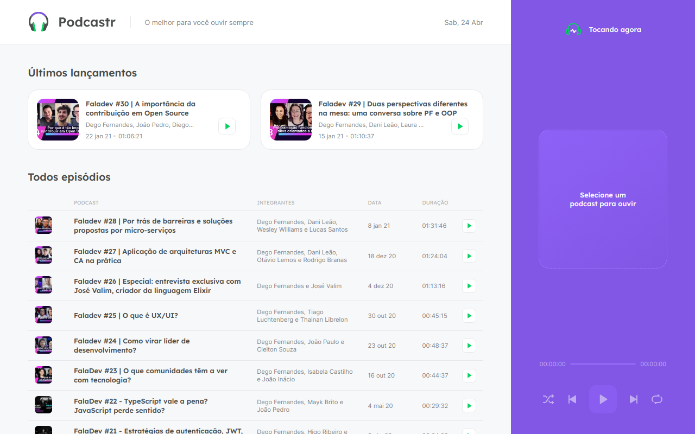

<h1 align="center">
  
</h1>

This is a project developed during the **[Next Level Week](https://nextlevelweek.com/)**, presented by **[@Rocketseat](https://github.com/Rocketseat)** during April 19-25, 2021.

## 🛠 Tecnologies

- [Next JS](https://nextjs.org/)
- [React](https://reactjs.org)
- [TypeScript](https://www.typescriptlang.org/)
- [Docker](https://www.docker.com/)
- [Docker Compose](https://docs.docker.com/compose/)

## 🔖 Result

The final result is available at: **https://nlw5-podcastr-wine.vercel.app**

<h1 align="center">
  
</h1>

## 🚀 Getting started

First, you need to start the app container

```bash
docker-compose up -d
```

### Running the JSON server

Open the container shell using this command

```bash
docker exec -it podcastr_dev sh
```

Run the JSON server

```sh
yarn server
```

### Starting the development server

Open the container shell using this command

```bash
docker exec -it podcastr_dev sh
```

Start the project

```sh
yarn dev
```
